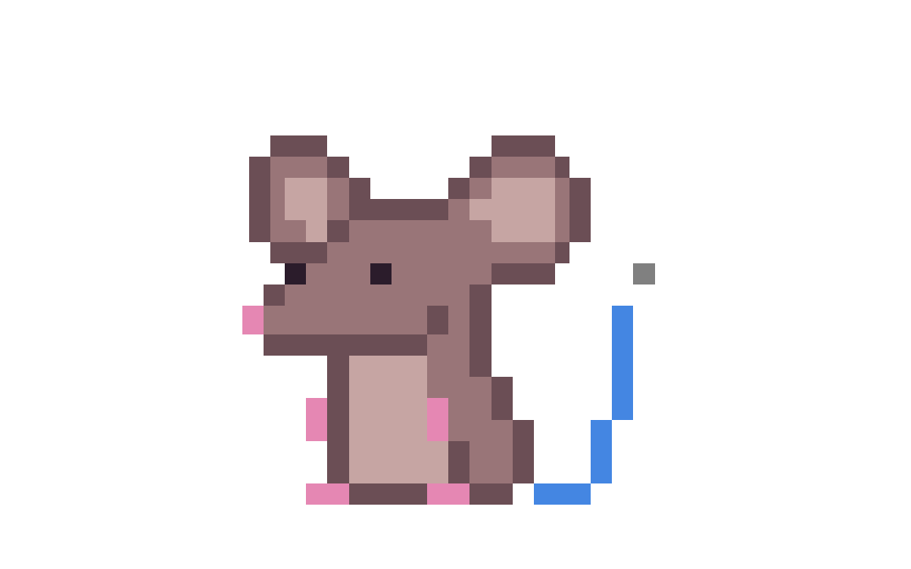

<!--
repo name: jerrys-pixel-ixons
description: An awesome pixel-art icons theme for your file explorer
github name:  wolfsouldev
link: https://github.com/wolfsouldev/jerrys-pixel-icons/issues
logo path: assets/logo.png
-->

<!-- PROJECT LOGO -->
<br />
<p align="center">
    <a href="https://github.com/wolfsouldev/jerrys-pixel-icons">
        
    </a>
<div align="center">

![Version][version-shield]
[![Contributors][contributors-shield]][contributors-url]
[![Stargazers][stars-shield]][stars-url]
[![MIT License][license-shield]][license-url]

</div>
    <p align="center">
        A Visual Studio Code extension that adds pixel art-style icons to your file explorer. Give your favorite editor a fun touch!
        <br />
        <a href="https://marketplace.visualstudio.com/items?itemName=MelissaGutierrez.jerrys-pixel-icons&ssr=false#overview"><strong>★ Visual studio market place ★</strong></a>
        <br />
        <br />
        <a href="https://github.com/wolfsouldev/jerrys-pixel-icons/issues">Report Bug</a>
        •
        <a href="https://github.com/wolfsouldev/jerrys-pixel-icons/issues">Request Icon</a>
    </p>
</p>

<!-- TABLE OF CONTENTS -->

## Table of Contents

- [Table of Contents](#table-of-contents)
- [Some Examples](#some-examples)
- [Getting Started](#getting-started)
  - [Prerequisites](#prerequisites)
  - [Installation](#installation)
  - [Activating The Extension](#activating-the-extension)
- [Customization](#customization)
- [Reporting Issues](#reporting-issues)
- [Contributing](#contributing)
  - [Adding a New Icon](#adding-a-new-icon)
- [License](#license)
- [Contact](#contact)

<!-- SOME EXAMPLES -->

## Some Examples

![Examples][examples]

<!-- GETTING STARTED -->

## Getting Started

### Prerequisites

- [VS Code](https://code.visualstudio.com) v1.105.0 or superior

### Installation

1. Open VS Code
2. Go to the Extensions tab Ctrl+Shift+X`
3. Search for "Jerry's Pixel Icons"
4. Click Install

Or install directly from the [VS Code Marketplace](https://marketplace.visualstudio.com/items?itemName=MelissaGutierrez.jerrys-pixel-icons&ssr=false#overview)

### Activating the Extension

1. Press `Ctrl+Shift+P`
2. Type "File Icon Theme"
3. Select "Jerry's Pixel Icons"

<!-- CUSTOMIZATION -->

## Customization

You can customize the extension from VS Code Settings (`Ctrl+,`) or by using the Command Palette (`Ctrl+Shift+P`).

### Settings

| Setting                                       | Description                                         | Default   |
| --------------------------------------------- | --------------------------------------------------- | --------- |
| `jerrysPixelIcons.iconSize`                   | Icon display size: `small`, `default`, `large`      | `default` |
| `jerrysPixelIcons.opacity`                    | Icon opacity from 0.1 to 1.0                        | `1.0`     |
| `jerrysPixelIcons.saturation`                 | Color saturation: 0 (grayscale) to 1.0 (full color) | `1.0`     |
| `jerrysPixelIcons.hidesExplorerArrows`        | Hide folder expand/collapse arrows                  | `false`   |
| `jerrysPixelIcons.files.customAssociations`   | Custom file extension → icon mappings               | `{}`      |
| `jerrysPixelIcons.folders.customAssociations` | Custom folder name → icon mappings                  | `{}`      |

### Commands

Open the Command Palette (`Ctrl+Shift+P`) and search for:

- **Jerry's Pixel Icons: Change Icon Size** — Pick between small, default, and large
- **Jerry's Pixel Icons: Change Opacity** — Adjust icon transparency
- **Jerry's Pixel Icons: Change Saturation** — Adjust color intensity
- **Jerry's Pixel Icons: Toggle Folder Arrows** — Show/hide explorer arrows
- **Jerry's Pixel Icons: Show Available Icons** — Browse icon keys for custom associations
- **Jerry's Pixel Icons: Restore Default Configuration** — Reset all settings
- **Jerry's Pixel Icons: Activate Icon Theme** — Quick-activate the theme

### Custom Associations Example

In your `settings.json`:

```json
{
  "jerrysPixelIcons.files.customAssociations": {
    "stories.tsx": "jsx",
    "spec.ts": "ts"
  },
  "jerrysPixelIcons.folders.customAssociations": {
    "features": "components",
    "modules": "lib"
  }
}
```

<!-- REPORT AN ISSUE -->

## Reporting Issues

If you find any issues or have suggestions, please contact us:

1. Go to the [GitHub repository](https://github.com/wolfsouldev/jerrys-pixel-icons)
2. Open an issue
3. Include:
   - Description of the problem
   - Screenshot (if applicable)
   - VS Code version

<!-- CONTRIBUTING -->

## Contributing

Any contributions you make are **greatly appreciated**.

1. Fork the Project
2. Create your Feature Branch (`git checkout -b feature/AmazingFeature`)
3. Commit your Changes (`git commit -m 'Add some AmazingFeature'`)
4. Push to the Branch (`git push origin feature/AmazingFeature`)
5. Open a Pull Request

### Adding a New Icon

Want to add a new icon? Here's the quick version:

1. Create your pixel art at **16×16 pixels**
2. Export as **PNG at 256×256** using **Nearest Neighbor** interpolation
3. Convert the PNG to an SVG with embedded base64 (see template below)
4. Place the `.svg` in `icons/files/` or `icons/folders/`
5. Register the icon in `src/baseTheme.ts` (`ICON_PATHS` + the appropriate mapping)
6. Compile (`pnpm install && pnpm run compile`) and test with **F5**

**SVG Template:**

```xml
<svg xmlns="http://www.w3.org/2000/svg"
     xmlns:xlink="http://www.w3.org/1999/xlink"
     width="256" height="256" xml:space="preserve"
     version="1.1" viewBox="0 0 256 256">
  <image width="256" height="256"
         xlink:href="data:image/png;base64,YOUR_BASE64_HERE"/>
</svg>
```

> For the full step-by-step guide with scripts, checklist, and naming conventions, see **[docs/adding-icons.md](docs/adding-icons.md)**.

<!-- LICENSE -->

## License

Distributed under the MIT License. See `LICENSE` for more information.

<!-- CONTACT -->

## Contact

★ Developer - [linkedin.com/in/alejandro-fajardo](https://www.linkedin.com/in/alejandro-fajardo-1548a0245)

★ Icon Artist - [linkedin.com/in/melissa-gutierrez](https://www.linkedin.com/in/melissa-gutierrez-47356b2b6/)

★ Project Link: [https://github.com/wolfsouldev/jerrys-pixel-icons](https://github.com/wolfsouldev/jerrys-pixel-icons)

<!-- MARKDOWN LINKS & IMAGES -->

[version-shield]: https://img.shields.io/badge/version-0.3.0-blue.svg?style=flat-square
[contributors-shield]: https://img.shields.io/github/contributors/wolfsouldev/jerrys-pixel-icons.svg?style=flat-square
[contributors-url]: https://github.com/wolfsouldev/jerrys-pixel-icons/graphs/contributors
[stars-shield]: https://img.shields.io/github/stars/wolfsouldev/jerrys-pixel-icons.svg?style=flat-square
[stars-url]: https://github.com/wolfsouldev/jerrys-pixel-icons/stargazers
[license-shield]: https://img.shields.io/github/license/wolfsouldev/jerrys-pixel-icons.svg?style=flat-square
[license-url]: https://github.com/wolfsouldev/jerrys-pixel-icons/blob/master/LICENSE
[examples]: https://raw.githubusercontent.com/wolfsouldev/jerrys-pixel-icons/refs/heads/master/assets/example.webp
